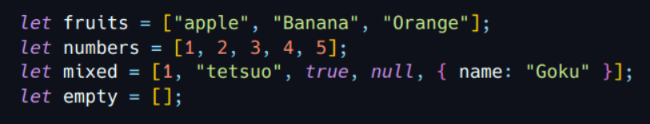
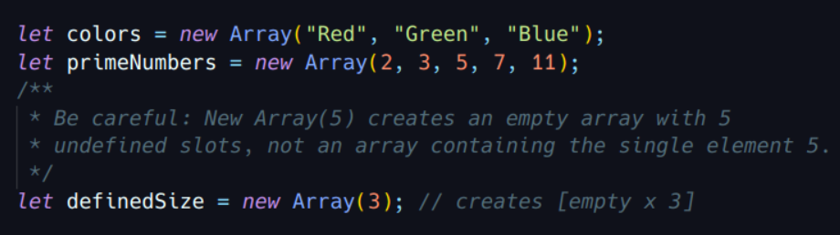
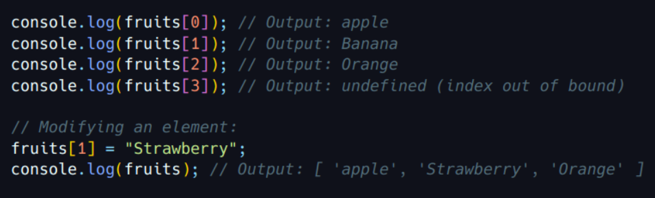
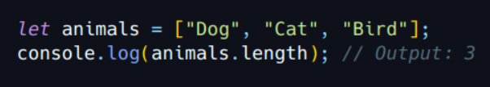
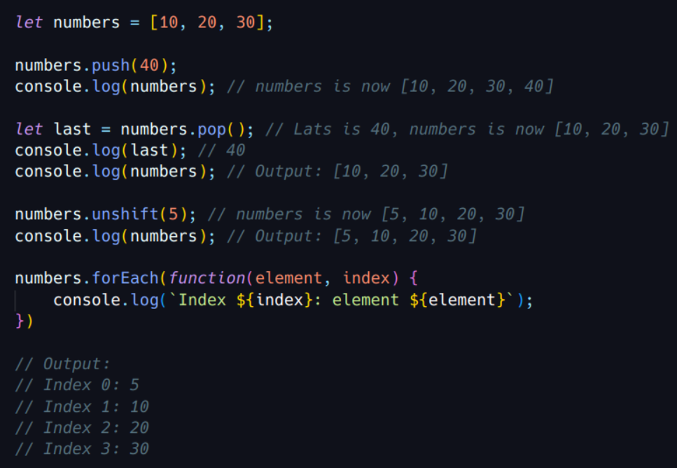
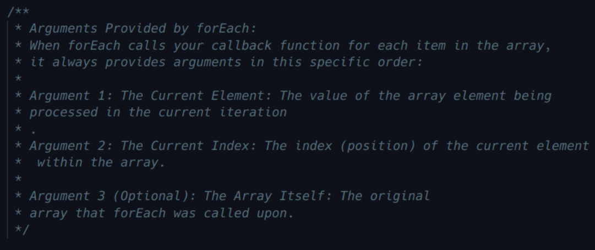
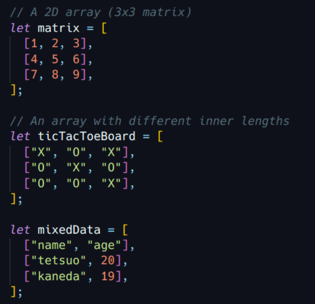
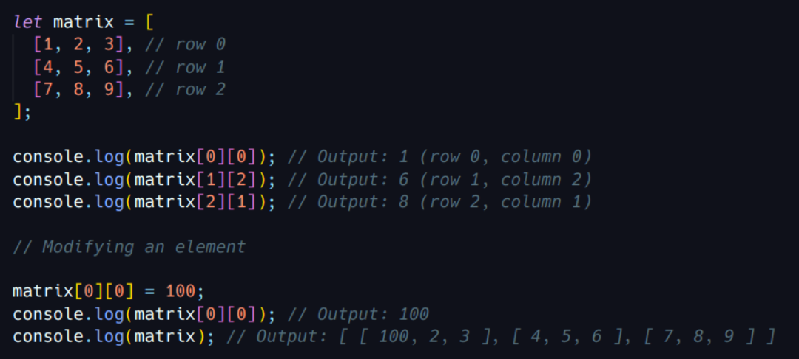
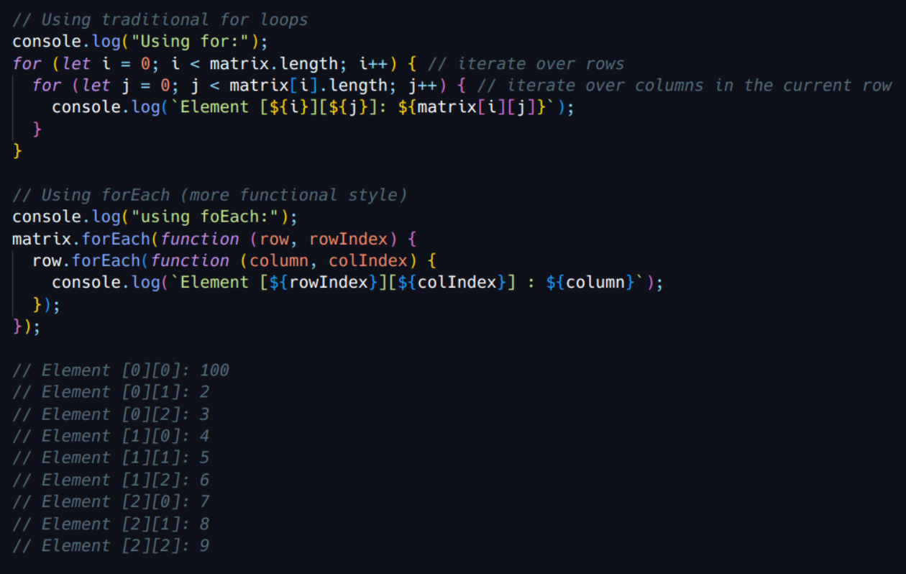

# Simple Arrays ( One-Dimensional)

A simple array in JavaScript is an ordered collection of elements. These elements can be of any type: numbers, strings, booleans, objects, or even other arrays.

### Declaration

We can declare an array in a few ways:

1. **Array Literal:** This is the most common and concise way:

2. **Array() Constructor**:

#### Accessing Elements

Array elements are accessed using a numerical index, starting from zero (0).

#### Length **Property**

The _length_ property returns the number of elements in the array.

#### Commom Methods

JavaScript provides many useful methods for manipulating arrays:

- push(): Adds one or more elements to the end of an array.
- pop(): Removes the last element from an array and returns it.
- shift(): Removes the first element from an array and returns it.
- unshift(): Adds one or more elements to the beginning of an array.
- indexOf(): Returns the first index at which a given element can be found in the array (-1 if not present).
- slice(): Returns a shallow(superficial) copy of a portion of an array.
- splice(): Changes the contents of an array by removing, replacing, or adding elements.
- forEach(): Executes a provided function once for each array element.
- map(): Creates a new array polulated with the results of calling a provided function on every element in the calling array. 
- filter(): Creates a new array with all elements that pass the test implemented by the provided function.

### Multidimensional Arrays

JavaScript doesn't have "true" multidimensional arrays like some other languages (e.g., matrices in C or Java). Instead, you create an "array of arrays", where each element of the main array it itself another array.

#### Declaration
You declare a multidimentsional array by nesting arrays:

#### Accessing Elements

To access an element in a multidimensional array, you use multiple indices: the first for the outer array(row) and the second for the inner array(column).

#### Iteration

To loop through all elements of a multidimensional array, you typically use nested loops (one loop for each dimension):

